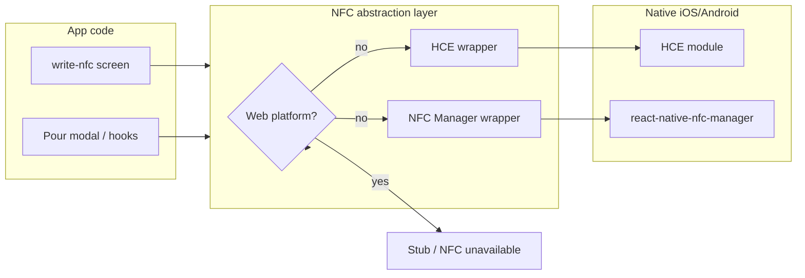

# Replace NFC implementation with HCE and platform-aware wrapper

## Current state (post-implementation)

- **NFC abstraction**: [src/services/nfc/](src/services/nfc/) — `isWeb()`, `getNfcManager()`, `getHCEModule()`; web returns null to avoid loading native modules.
- **Writer flow**: NFCWriterStore **removed**. [write-nfc.tsx](src/routes/(tabs)/(menu)/write-nfc.tsx) uses `useWriteNfcFlow()` and `useCreateNfcTagAuthorization()`; instructions → login → writing with NDEF write loop and cleanup.
- **Pour flow**: [PourProcessContext.tsx](src/hooks/context/PourProcessContext.tsx) refactored to use `getNfcManager()` for NFC detection and **HCE** (no tag reading): when modal opens and NFC enabled, `usePourWithHCE()` gets token from `api/authorizations/nfc-tag`, starts HCE session; on readerDeselected/success closes modal. TOTP path unchanged. [PourProcessModal.tsx](src/components/modals/PourProcessModal.tsx) uses `getNfcManager()?.goToNfcSetting()` only when available.
- **app.json**: `plugins` array fixed (array of plugin names).
- **Brewskey.Device**: Type 4 NDEF read implemented (Section 8): Type4Tag driver, APDU SELECT AID D2760000850101 / SELECT file E104 / READ BINARY; NfcAdapter uses it for TAG_TYPE_4 and tagPresent inlists the tag for inDataExchange.

## Target architecture (after changes)

- **Hooks and queries instead of stores/context**: Replace NFCWriterStore and PourProcessContext with hooks and React Query. Queries for API calls (e.g. `api/authorizations/nfc-tag`); some queries may need to make multiple API calls. No stores or context for NFC/pour.
- **react-native-nfc-manager**: Used **only for writing to physical NFC cards** (write-nfc screen). Token from `api/authorizations/nfc-tag`. HCE cannot write to another card.
- **react-native-host-card-emulation**: Used **only for the pour flow**. User taps **phone** (HCE) to the Brewskey Box reader; phone emulates the card. Token for HCE from `api/authorizations/nfc-tag`. This **replaces** the current tag-reading pour path entirely (no react-native-nfc-manager in pour flow).

---

## Architecture (NFC abstraction — web vs native)

- **Web**: All NFC entry points go through a thin layer that checks **platform** (e.g. `Platform.OS === 'web'`). On web, never require the native NFC or HCE modules; expose no-ops or "NFC not available" so the app does not crash.
- **Native (iOS/Android)**: Same code path loads the real native modules (HCE for pour; react-native-nfc-manager for card writing only).

---

## 1. NFC abstraction layer (web vs native)

- Add a single place that decides whether native NFC/HCE is available by checking **platform**: use `Platform.OS === 'web'` (from `react-native`). On web, native NFC and HCE are not available; on iOS/Android, load the real modules.
- **Location**: e.g. `src/services/nfc/` or `src/utils/nfc/` (new folder).
- **Exports**:
  - `isWeb(): boolean` (or equivalent) — so callers know when to show "NFC not available" or hide NFC options.
  - `getNfcManager(): NfcManager | null` — returns `require('react-native-nfc-manager')` only when not web (`Platform.OS !== 'web'`); otherwise `null` or a stub that exposes safe no-op methods and `isSupported() -> false` so UI can show "NFC not available".
  - `getHCEModule(): NativeHCEModule | null` — same idea for `@icedevml/react-native-host-card-emulation` (use the package's actual export path). On web, return `null` or a stub that implements the same interface with no-ops and `isPlatformSupported() -> false`.
- Use **dynamic require** (or a small factory) so the native modules are not loaded at bundle load time on web; only when not web and the feature is used. This avoids crashes from missing native code on web.
- All call sites (write-nfc screen, pour modal, and any hooks that use NFC/HCE) must use these getters instead of direct imports of the native modules.

---

## 2. Integrate @icedevml/react-native-host-card-emulation

- **Dependency**: Add `@icedevml/react-native-host-card-emulation`. Keep `react-native-nfc-manager` for **writing to physical cards** only (not used in pour flow).
- **New Architecture**: The library requires New Architecture; [app.json](app.json) already has `newArchEnabled: true`.
- **Native setup** (no Expo config plugin in the library):
  - **Android**: Add the required `<service>`, `<intent-filter>`, and `android:name` in [android/app/src/main/AndroidManifest.xml](android/app/src/main/AndroidManifest.xml); add `android/app/src/main/res/xml/aid_list.xml` with the AIDs your reader expects (align with Brewskey Box / backend; see "Reader protocol" below).
  - **iOS**: Add HCE entitlement and AIDs (via Xcode or entitlements file); the library's README states HCE is EEA-only on iOS 17.4+ and requires an Apple HCE entitlement.
- **Expo prebuild**: If you use `expo prebuild`, add a **custom config plugin** (in the repo) that injects the Android manifest entries and AID list, and iOS HCE entitlement, so the project stays CNG-friendly. Otherwise document manual steps for prebuild and native projects.
- **Usage**: Only ever access the HCE module via the platform wrapper (e.g. `getHCEModule()`). If the wrapper returns `null` (web or unsupported), do not call HCE APIs.

---

## 3. Reader protocol (Brewskey.Device in reader mode)

**Source**: [Brewskey.Device](https://github.com/Brewskey/Brewskey.Device) when configured in **reader mode** (e.g. `DeviceNFCStatus::CARD_ONLY`). Key files: [NfcClient.cpp](Brewskey.Device/src/Tappt/NfcClient/NfcClient.cpp), [NfcAdapter.cpp](Brewskey.Device/src/NDEF/NfcAdapter.cpp).

- **How the device reads in reader mode**:
  - Uses PN532 with **ISO14443A** (`readPassiveTargetID(PN532_MIFARE_ISO14443A)`). [NfcAdapter::read()](Brewskey.Device/src/NDEF/NfcAdapter.cpp) uses **guessTagType()** and supports **Mifare Classic** and **Mifare Ultralight** (and has a stub for Type 4 / DESFire — returns NfcTag with UID only, no NDEF read yet).
  - For Mifare tags it reads an **NDEF message** from the tag. [NfcClient::ReadMessage()](Brewskey.Device/src/Tappt/NfcClient/NfcClient.cpp) gets the NdefMessage, iterates **all NDEF records**, and **concatenates each record's payload** (as string) into a single `authenticationKey`. That string is the **token**.
  - It then calls `serverLink->AuthorizePour(deviceId, readAuthenticationKey)` — i.e. the device sends the token to the server for pour authorization.

- **Token format the reader expects**: The **payload** of the NDEF record(s) concatenated = authentication token. The app currently writes a **single NDEF text record** with the token; the device concatenates record payloads, so one text record is exactly what the reader uses.

- **HCE (phone as card) — Type 4 only**: Android and iOS HCE use **ISO-DEP (ISO 14443-4)**, i.e. **Type 4** protocol with APDU; they do **not** emulate Type 2 (Mifare Ultralight). So we cannot use Type 2 for the phone-as-card flow; the phone must emulate a **Type 4** tag. The [react-native-host-card-emulation demo-ndef-app](https://github.com/icedevml/react-native-host-card-emulation/tree/master/packages/demo-ndef-app) emulates an **NDEF Type 4 tag** (responds to SELECT file, READ BINARY, etc. with NDEF content). The app must respond to the reader's APDU sequence with the **same token** in NDEF format (e.g. NDEF file content that decodes to a single text record with the token). Use the demo-ndef-app and the library's APDU flow as reference; AID list must match what the reader uses (e.g. standard NDEF Type 4 AIDs).

- **Type 2 vs Type 4**: **Physical cards** written by the app can be Type 2 (Mifare Ultralight); Brewskey.Device already reads them in reader mode. **Phone in HCE** can only present as Type 4 (platform limitation). So: writer flow = write NDEF to Type 2 (or Classic) cards; pour flow with HCE = phone presents as Type 4.

- **Device firmware note**: Current Brewskey.Device [NfcAdapter::read()](Brewskey.Device/src/NDEF/NfcAdapter.cpp) for **TAG_TYPE_4** returns an NfcTag with no NDEF content (TODO). For HCE (Type 4) to work end-to-end, the device needs a **Type 4 NDEF read path** in firmware (read via ISO-DEP/APDU and parse NDEF from the response). App side: implement HCE to present the token as NDEF Type 4 content per the demo; align AIDs with the reader when the device supports Type 4 read.

---

## 4. Writer flow: fix write-nfc.tsx — hooks + React Query (no NFCWriterStore)

**Reference**: Brewskey.App [WriteNFCScreen.js](Brewskey.App/src/screens/WriteNFCScreen.js) and [NFCWriterStore.js](Brewskey.App/src/stores/NFCWriterStore.js) define the intended behavior. Move away from NFCWriterStore and implement the same flow with hooks and React Query.

- **Three-state flow** (restore in write-nfc.tsx):
  1. **instructions**: Intro text + "Next" → transition to **login**. (Reset token when leaving.)
  2. **login**: LoginForm; on submit → call `POST api/authorizations/nfc-tag/` with body `{ expiresDate: null, useAnonymous: false }` and Bearer token from auth; on success store token and transition to **writing**. On error show snackbar (e.g. "There was an error getting your NFC token ready.").
  3. **writing**: "Tap your NFC card to the back of your phone..." + "Go Back" → transition back to **login** (reset token). While in writing: register for tag events, then in a loop write NDEF text record (token) to the card; on success show "You've successfully written to your card.", on failure "Card didn't write. Try again!"; wait ~1s and retry. On screen unmount: cancel write, unregister tag event, clear token.

- **No stores**: Replace [NFCWriterStore.ts](src/stores/NFCWriterStore.ts) entirely with:
  - **Mutation**: e.g. `useCreateNfcTagAuthorization()` that calls `POST api/authorizations/nfc-tag` with auth (Auth.login for credentials, then fetch with Bearer token and body `{ expiresDate: null, useAnonymous: false }`). Returns the `token` from the response.
  - **Hook**: e.g. `useWriteNfcCard(token)` or a single `useWriteNfcFlow()` that exposes: status (`'instructions' | 'login' | 'writing'`), `goToLogin`, `onLoginSuccess` (mutation + transition to writing), `goBackToLogin`, and the writing loop + cleanup. Writing logic uses `getNfcManager()` from the NFC abstraction layer (NfcManager + Ndef, `registerTagEvent` / `ndefHandler.writeNdefMessage` or equivalent, `cancelTechnologyRequest` / `unregisterTagEvent` on cleanup). On web or when NFC unavailable, show "NFC not available" (or similar) and do not start writing.

- **write-nfc screen** ([write-nfc.tsx](<src/routes/\(tabs)/(menu)/write-nfc.tsx>)): **Fix** by wiring the UI to the new hook/mutation:
  - **Next** (instructions) → `goToLogin()` or set status to `'login'`.
  - **LoginForm** → `onSubmit` = call mutation (with form credentials or existing auth session as appropriate); on success run `onLoginSuccess()` to move to writing and start the write loop.
  - **Go Back** (writing) → `goBackToLogin()`.
  - Use `useEffect` cleanup (or hook cleanup) to run reset/unregister when the user leaves the screen. Keep existing testIDs; add testIDs for login form and Go Back if missing.

---

## 5. Pour flow: HCE (phone as card) — replace tag reading

- **Replace PourProcessContext with hooks and queries**: Remove the context-based pour flow. Implement pour authorization with:
  - **Request token**: Call `api/authorizations/nfc-tag` to get the token. Use a query or mutation (e.g. `useNfcTagToken()` or similar) that may combine multiple API calls if needed.
  - **HCE session**: A hook (e.g. `useHCESession()` or `usePourWithHCE()`) that uses `getHCEModule()` from the NFC abstraction layer. When user chooses "Tap phone to pour": request token, then `beginSession()` → `startHCE()`, subscribe to `onEvent`, on `received` respond with the token in the format the reader expects (NDEF Type 4 / APDU per reader protocol). **On successful read(s)** (reader has successfully read the token from the phone), **close the modal**. On `readerDeselected` / `sessionInvalidated`, clean up. The reader/backend performs pour authorization when it reads the token; the app does not call `POST /api/authorizations/pour/` in the HCE path.
  - **TOTP fallback**: Keep the existing TOTP pour path (e.g. `POST /api/authorizations/pour/` with code); no NFC required.
- **Pour modal** (or equivalent UI): Use the new hooks. When not web and HCE is supported: show "Tap phone to reader" and start HCE via the hook; close modal on successful read(s). When web or HCE unsupported: only show TOTP option. For "open NFC settings" use `getNfcManager()?.goToNfcSetting()` only when the module is available (for card-writing flow elsewhere). No tag reading; no react-native-nfc-manager in the pour flow.

---

## 6. app.json and plugins

- Fix the `plugins` array in [app.json](app.json): change `"react-native-nfc-manager"` to `["react-native-nfc-manager"]` so it is a valid config plugin entry.
- If you introduce a custom config plugin for HCE (Android manifest + AID list, iOS entitlement), add it to `plugins` and document that HCE is only available in dev/production builds.

---

## 7. Documentation and constraints

- **Docs**: In README or docs, state that (1) NFC and HCE are not available on **web**; they work on native iOS/Android (dev build or production). (2) iOS HCE: EEA only, iOS 17.4+, and Apple HCE entitlement. (3) Reader protocol and AID list must match the Brewskey Box.
- **Testing**: E2E tests that touch NFC/HCE should be skipped or run only in dev build; document how to run them (e.g. `test:e2e` with a flag or environment that assumes dev build). Preserve testIDs for the write-nfc and pour flows.

---

## 8. Work item: Brewskey.Device — add Type 4 reader support — **DONE**

- **Where implemented**: Local [Brewskey.Device](https://github.com/Brewskey/Brewskey.Device) repo.
- **Goal**: In reader mode (e.g. `DeviceNFCStatus::CARD_ONLY`), support **reading Type 4 tags** (ISO 14443-4 / ISO-DEP) so the device can read the **phone when the phone is in HCE** (phone presents as Type 4).
- **Implemented**:
  - **[Type4Tag](Brewskey.Device/src/NDEF/Type4Tag.cpp)** driver: SELECT NDEF AID `D2760000850101`, SELECT NDEF file `E104`, READ BINARY; parse NDEF and return `NfcTag` with `NdefMessage` (same as Mifare path).
  - **NfcAdapter**: `tagPresent()` now calls `readPassiveTargetID(..., inlist=true)` so the PN532 keeps the tag inlisted for `inDataExchange()` (required for Type 4 APDU). `read()` for `TAG_TYPE_4` uses `Type4Tag::read()` instead of the previous stub.
  - Existing [NfcClient::ReadMessage()](Brewskey.Device/src/Tappt/NfcClient/NfcClient.cpp) unchanged: it still concatenates NDEF record payloads into `authenticationKey` and calls `AuthorizePour(deviceId, readAuthenticationKey)`.
- **Outcome**: "Tap phone to reader" works end-to-end once the app presents the token as NDEF Type 4 (SELECT AID D2760000850101, file E104, READ BINARY).

---

## File and dependency summary

- **Add**: `@icedevml/react-native-host-card-emulation`
- **Keep**: `react-native-nfc-manager` (used only for writing to physical cards on write-nfc screen)
- **Add**: `src/services/nfc/` (or `src/utils/nfc/`): Expo-safe wrapper (isExpoGo, getNfcManager, getHCEModule)
- **Remove**: [NFCWriterStore.ts](src/stores/NFCWriterStore.ts) — replace with hooks + query for `api/authorizations/nfc-tag` and hook for writing (getNfcManager)
- **Remove / refactor**: [PourProcessContext.tsx](src/hooks/context/PourProcessContext.tsx) — replace with hooks + HCE hook + query/mutation for pour; no tag reading
- **Refactor**: [PourProcessModal.tsx](src/components/modals/PourProcessModal.tsx): use new pour hooks; HCE for "tap phone to pour"; getNfcManager only for goToNfcSetting when available
- **Fix**: [write-nfc.tsx](<src/routes/\(tabs)/(menu)/write-nfc.tsx>): restore full flow (instructions → login → writing) using hooks + React Query; wire Next, LoginForm onSubmit, Go Back, and unmount cleanup; no NFCWriterStore
- **Fix**: [app.json](app.json): plugins array — `["react-native-nfc-manager"]`
- **Optional**: Custom Expo config plugin for HCE native setup (Android + iOS)

---

## Order of implementation

Work through the [fine-grained todo list](#todo-list) in order; mark items completed as you go.

1. Fix app.json plugins; add NFC abstraction layer (web check, getNfcManager, getHCEModule).
2. Add HCE dependency and native setup (manifest, AID list, iOS entitlement); add config plugin if desired.
3. Add mutation for `api/authorizations/nfc-tag` and useWriteNfcFlow hook. Fix write-nfc.tsx; remove NFCWriterStore when unused.
4. Add HCE pour hook; replace PourProcessContext with pour hooks; refactor PourProcessModal (HCE + TOTP).
5. Align HCE APDU/NDEF responses with reader protocol.
6. **Verification**: Run `npm run build` in **Brewskey.App-v3** to verify the app builds. Do not build Brewskey.Device.
7. **Brewskey.Device** (local repo): Type 4 NDEF read support — see [Section 8](#8-work-item-brewskeydevice--add-type-4-reader-support). Tracked in todo list; out of scope for app build verification.

---

## Todo list (track progress here)

- **fix-app-json-plugins**: Fix app.json plugins array — **completed**
- **nfc-abstraction-layer**: Add NFC abstraction (isWeb, getNfcManager, getHCEModule) — **completed**
- **add-hce-dependency**: Add @icedevml/react-native-host-card-emulation — **completed**
- **hce-native-setup**: HCE native setup (Android manifest + aid_list.xml; iOS optional) — **completed**
- **nfc-tag-mutation**: Add mutation for api/authorizations/nfc-tag — **completed**
- **use-write-nfc-flow-hook**: Add useWriteNfcFlow hook — **completed**
- **fix-write-nfc-screen**: Fix write-nfc.tsx wiring — **completed**
- **remove-nfc-writer-store**: Remove NFCWriterStore — **completed**
- **hce-pour-hook**: Add HCE pour hook (usePourWithHCE) — **completed**
- **replace-pour-context**: Replace PourProcessContext; refactor PourProcessModal — **completed**
- **hce-apdu-ndef-align**: Align HCE APDU/NDEF with reader protocol (minimal 9000 response in place; full NDEF Type 4 when device has Type 4 read) — **completed**
- **verify-npm-build**: Run `npm run build` in Brewskey.App-v3 to verify — **completed**
- **device-type4**: Brewskey.Device (local): Type 4 reader support — **completed**

Mark each task completed by setting its `status` to `completed` in the frontmatter `todos` above.

---

## Plan complete (Brewskey.App-v3 scope)

All in-scope work for **Brewskey.App-v3** is done:

- **NFC abstraction** (`src/services/nfc/`), **writer flow** (hooks + mutation, write-nfc.tsx fixed, NFCWriterStore removed), and **pour flow** (HCE via usePourWithHCE, PourProcessContext refactored, TOTP kept) are implemented.
- **Build**: `npm run build` passes.
- **Deferred**: Full NDEF Type 4 APDU response in the app can be refined when Brewskey.Device supports Type 4 read; current HCE responds with `9000`. **Brewskey.Device** Type 4 reader support remains a separate work item in that repo (Section 8).
